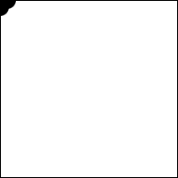

# Tarea 04. Condicionales.

**DEADLINE: 03 Abril 2019**

### Instrucciones

Los siguientes ejercicios son descripciones de sketches de Processing. Para resolverlas tienes que hacer uso de las condicionales vistas en clase.

En cada ejercicio debes de:
  * Programar el sketch de Processing que resuelva la dinámica correspondiente.
  * Por cada condicional que uses en el sketch, escribe en español la lógica que estás ocupando.
  Por ejemplo: "_Si `x` es mayor al ancho del canvas, entonces `x = 0`_".
  * Por cada condicional que uses en el sketch, dibuja el diagrama de flujo que describa la lógica que estás ocupando.

Las respuestas deben ir en folders separados con el nombre del ejercicio.

### Ejercicios
1. **Horizontal y Vertical**. Dos elipses, una recorre el eje horizontal, y cada vez que se recorre hacia abajo. Y la otra recorre el eje vertical, y cada vez que se recorre hacia la derecha.

2. **Bouncing Ball**. Elipse que rebota sin salirse del canvas. Es la misma que vimos en clase pero SIEMPRE debe verse completa. _Hint: guarda en una variable el tamaño de la elipse_.

3. **Multiple Bouncing Balls**. Lo mismo que el anterior, pero con 2 elipses de distinto tamaño.

4. **Sides**. Una elipse recorre los lados del canvas a una velocidad. _Hint: usa una variable entera para guardar en cuál lado estás_.

5. **Quadrants**. Se ilumina el cuadrante que donde está el mouse (el punto rojo). _Hint: se usa el operador `&&`_.

6. **GrowButtons**. Dos botones, uno agranda a un cuadro y el otro a una elipse. (En la muestra el click se ve con un circulo rojo).

7. Escoge alguno de los siguientes:
  a. **Stair**. Elipse que baja en escalera.
  b. **Spiral**. El mismo que el ejercicio `4.`, pero cuando completa una vuelta, se hace espiral.
  c. **ResetButtons**. El mismo que el ejercicio `6.`, pero agregando un tercer botón que resetea los tamaños.
  d. **Libre**. Haz un sketch libre que incluya mínimo 2 condicionales.

#### ¡Punto Extra!
Obtén un punto extra personalizando tus sketches, explorando diferentes colores, formas (no solo pintes elipses), sin pintar el fondo en el `draw`, etc.

Si tienes dudas no dudes en preguntar.

Happy Hacking! :D
